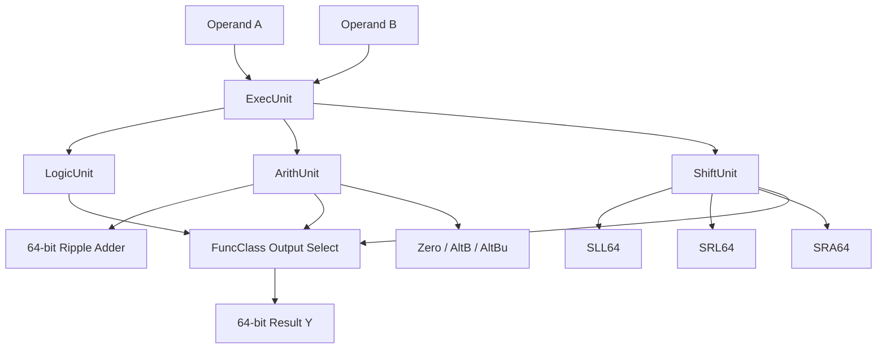

# 64-Bit RISC-V ExecUnit Simulation on Intel FPGA


A VHDL implementation and verification project for a **64-bit RISC-V Execution Unit** targeting an Intel Cyclone IV E FPGA. The design combines arithmetic, logic, and shift datapaths into a top-level `ExecUnit`, then validates the design through functional simulation, synthesis, fitting, post-fit netlist generation, and timing simulation.

The project demonstrates a complete FPGA digital-design workflow: write synthesizable VHDL, verify it with test vectors, synthesize the RTL in Intel Quartus Prime, generate a fitted gate-level netlist, and re-simulate the hardware-mapped design in ModelSim.

---

## Project Objectives

- Design an RV64I-compatible execution datapath using modular VHDL entities.
- Implement logic, arithmetic, branch/status, and shift operations.
- Support both 64-bit and selected 32-bit word operations using `ExtWord` sign extension.
- Verify functional behavior using ModelSim testbenches and `.tvs` test-vector files.
- Synthesize and fit the design for an Intel Cyclone IV E FPGA.
- Run post-fit timing simulation using Quartus-generated `.vho` and `.sdo` files.

---

## Architecture Overview



### Main Units

| Unit | File | Purpose |
|---|---|---|
| `ExecUnit` | `SourceCode/ExecUnit.vhd` | Top-level execution datapath that connects the logic, arithmetic, and shift units. |
| `LogicUnit` | `SourceCode/LogicUnit.vhd` | Performs RV64I logic operations including pass-B, XOR, OR, and AND. |
| `ArithUnit` | `SourceCode/ArithUnit.vhd` | Performs addition/subtraction, word sign extension, zero detection, overflow, and comparison flags. |
| `Adder` | `SourceCode/Adder.vhd` | Structural 64-bit ripple-carry adder built from full-adder cells. |
| `ShiftUnit` | `SourceCode/ShiftUnit.vhd` | Selects 64-bit and 32-bit shift behavior using barrel shifters and sign-extension logic. |
| `SLL64`, `SRL64`, `SRA64` | `SourceCode/SLL64.vhd`, `SourceCode/SRL64.vhd`, `SourceCode/SRA64.vhd` | 64-bit logical-left, logical-right, and arithmetic-right barrel shifters. |

---

## Design & Verification Flow


### Why each step matters

| Step | Tool | Why it is used |
|---|---|---|
| RTL design | VHDL | Describes the intended datapath and control behavior before mapping to FPGA hardware. |
| Functional simulation | ModelSim | Verifies logical correctness using test vectors before synthesis changes the representation. |
| Synthesis | Intel Quartus Prime | Converts RTL into FPGA-mappable logic elements and checks that the design is synthesizable. |
| Fitting | Intel Quartus Prime | Places and routes the synthesized logic onto the target Cyclone IV E device. |
| Post-fit netlist | Quartus `.vho` | Captures the hardware-mapped structural implementation after fitting. |
| Timing annotation | Quartus `.sdo` | Provides estimated propagation delays for realistic post-fit timing simulation. |
| Timing simulation | ModelSim | Re-runs the testbench against the post-fit netlist to validate behavior with delay information. |

---

## Verification Results

The top-level execution unit was synthesized and fitted successfully for the **Cyclone IV E EP4CE115F29C7** target device.

| Metric | ExecUnit Result |
|---|---:|
| Total logic elements | 1,705 / 114,480 — 1% |
| Total combinational functions | 1,705 / 114,480 — 1% |
| Dedicated logic registers | 0 / 114,480 — 0% |
| Total pins | 204 / 529 — 39% |
| Memory bits | 0 / 3,981,312 — 0% |
| Embedded multipliers | 0 / 532 — 0% |
| PLLs | 0 / 4 — 0% |

The design is primarily combinational, which matches the execution-unit role: operands and control signals are decoded into a result and status flags without storing state internally.

---

## Repository Structure

```text
64-Bit-RISC-V-ExecUnit-Simulation-Intel-FPGA/
├── Documentation/
│   ├── ExecUnit.map.summary
│   ├── ExecUnit.fit.summary
│   ├── LogicUnit.map.summary
│   ├── LogicUnit.fit.summary
│   ├── ArithUnit.map.summary
│   ├── ArithUnit.fit.summary
│   ├── ShiftUnit.map.summary
│   └── ShiftUnit.fit.summary
│
├── SourceCode/
│   ├── ExecUnit.vhd
│   ├── LogicUnit.vhd
│   ├── ArithUnit.vhd
│   ├── Adder.vhd
│   ├── ShiftUnit.vhd
│   ├── SLL64.vhd
│   ├── SRL64.vhd
│   └── SRA64.vhd
│
├── Simulation/
│   ├── TBExecUnit.vhd
│   ├── TBLogicUnit.vhd
│   ├── TBArithUnit.vhd
│   ├── TBShiftUnit.vhd
│   ├── ConfigExU.vhd
│   ├── ExecUnit00.tvs
│   ├── LogicUnit00.tvs
│   ├── ArithUnit00.tvs
│   ├── SLL64Unit00.tvs / SRL64Unit00.tvs / SRA64Unit00.tvs
│   ├── SLL32Unit00.tvs / SRL32Unit00.tvs / SRA32Unit00.tvs
│   ├── FunctionalExecUnit.do
│   ├── TimingExecUnit.do
│   ├── waveExecUnit.do
│   └── ModelSim/
│       ├── ExecUnit.vho
│       └── ExecUnit.sdo
│
├── output_files/
│   ├── FuncExecUnitTranscript.txt
│   ├── TimeExecUnitTranscript.txt
│   └── ShiftUnit timing/functional transcript outputs
│
├── ExU.qpf
├── ExU.qsf
├── ExU.qws
├── LICENSE
└── README.md
```

---

## How to Run

### 1. Open the Quartus project

Open `ExU.qpf` in **Intel Quartus Prime**.

For full top-level synthesis, set `ExecUnit` as the top-level entity and run:

```text
Processing → Start Compilation
```

Quartus generates synthesis and fitting reports, plus post-fit simulation artifacts such as:

```text
Simulation/ModelSim/ExecUnit.vho
Simulation/ModelSim/ExecUnit.sdo
```

### 2. Run functional simulation in ModelSim

Open the ModelSim project under `Simulation/`, then run:

```tcl
cd Simulation
do FunctionalExecUnit.do
```

This compiles the RTL entities, testbench, configuration file, loads `FuncXUSim`, applies `ExecUnit00.tvs`, and writes the functional transcript.

### 3. Run post-fit timing simulation

After Quartus compilation has produced the post-fit netlist and delay file, run:

```tcl
cd Simulation
do TimingExecUnit.do
```

This compiles the Quartus-generated structural netlist, applies the `.sdo` timing delay file, loads `TimeXUSim`, and writes the timing transcript.

---

## Key Takeaways

- Built a modular RV64I-style execution unit in VHDL.
- Integrated arithmetic, logic, shift, comparison, and status-flag generation.
- Used ModelSim test vectors to validate functional behavior.
- Used Quartus Prime to synthesize and fit the design to a Cyclone IV E FPGA.
- Used post-fit netlist and SDF timing data to validate FPGA-mapped behavior after place-and-route.

---

## Suggested ExecUnit Screenshots

For a concise GitHub README, keep only the most relevant visual evidence:

| Screenshot | Recommended path |
|---|---|
| ExecUnit RTL netlist view | `Documentation/images/execunit-rtl.png` |
| ExecUnit post-fit netlist view | `Documentation/images/execunit-postfit.png` |
| ExecUnit timing simulation waveform | `Documentation/images/execunit-timing.png` |

After adding those images to the repository, embed them here:

```md


```

---

## Tools Used

- **VHDL** — RTL design and structural datapath implementation
- **Intel Quartus Prime Lite** — synthesis, fitting, RTL viewer, post-fit netlist generation
- **ModelSim Intel FPGA Edition** — functional and timing simulation
- **Cyclone IV E FPGA target** — `EP4CE115F29C7`
- **Test-vector based verification** — `.tvs` stimulus files and transcript logging

---

## License

This project is licensed under the [MIT License](LICENSE).
